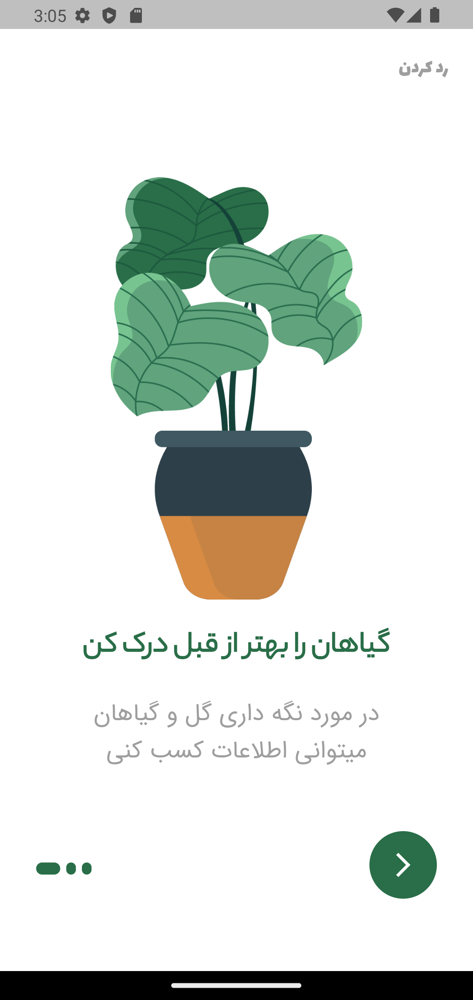
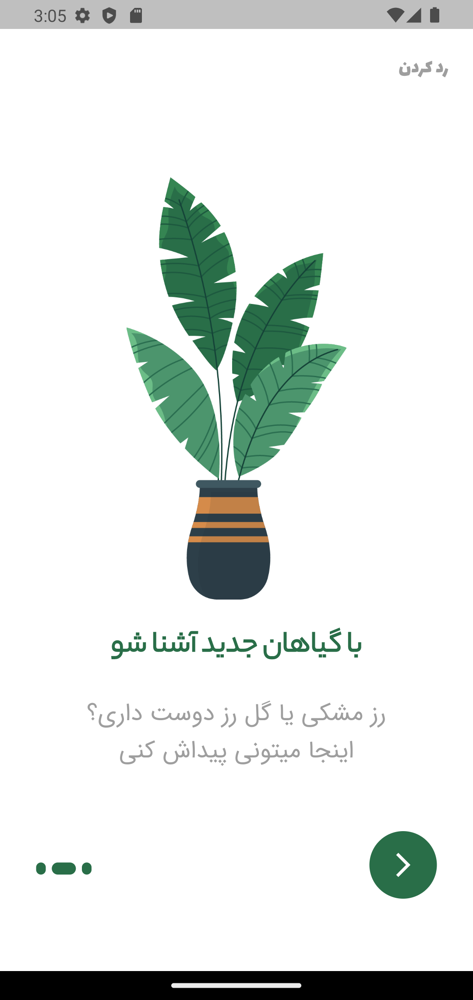
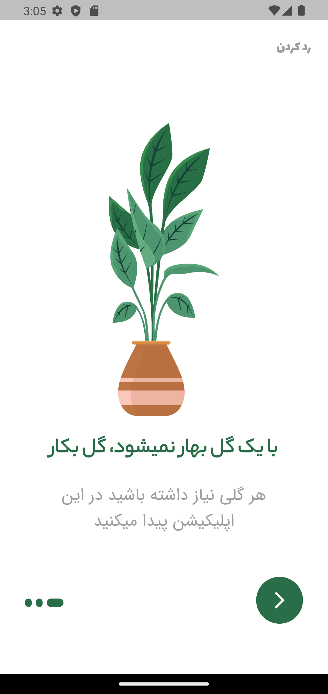
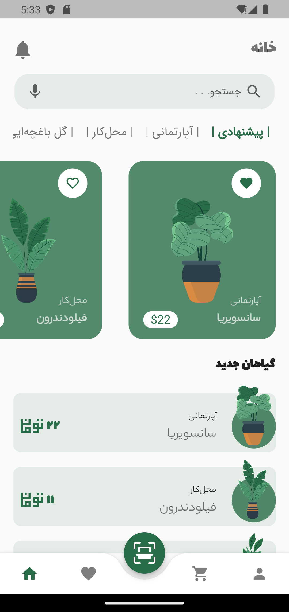
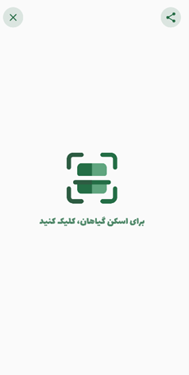
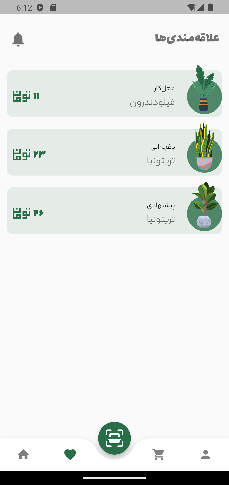
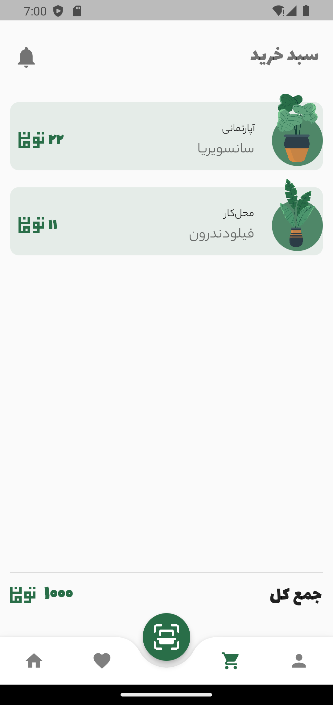
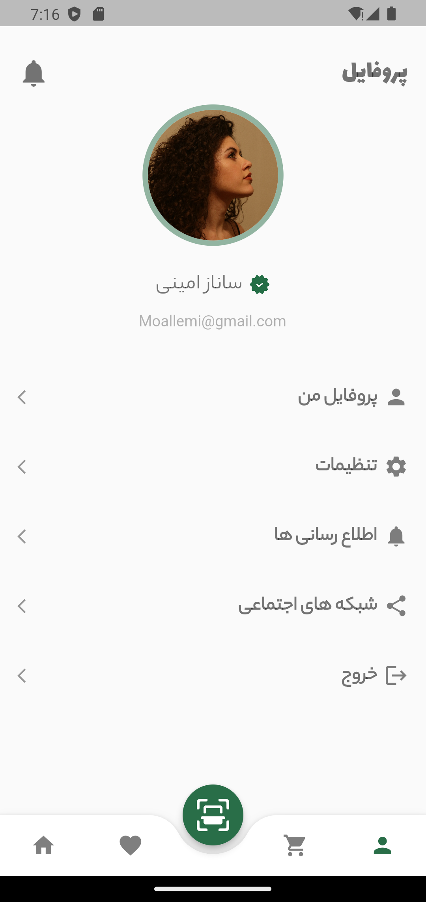

# 🌿 Plant App

یک اپلیکیشن مدرن و زیبا ساخته شده با **Flutter** برای معرفی و مدیریت گیاهان آپارتمانی، باغچه‌ای و محل‌کار.  
این پروژه بیشتر روی **UI/UX حرفه‌ای** تمرکز دارد و از انیمیشن‌ها و کتابخانه‌های محبوب Flutter استفاده می‌کند.

---

## ✨ ویژگی‌ها
- 🏡 دسته‌بندی گیاهان (آپارتمانی، محل‌کار، باغچه‌ای، پیشنهادی)
- ⭐ افزودن به علاقه‌مندی‌ها
- 🛒 مدیریت سبد خرید
- 🌱 اسکن گیاهان با دوربین (QR/Scanner)
- 📱 طراحی مدرن با انیمیشن‌های روان
- 🎨 استفاده از پکیج‌های کاربردی:
  - `animated_bottom_navigation_bar`
  - `page_transition`
  - `mobile_scanner`

---

## 📸 پیش‌نمایش اپلیکیشن

### 🚀 Splash Screens
<p align="center">
  
  
  
</p>

---

### 🏠 Home
<p align="center">
  
</p>

---

### 🌱 Plant Scanner
<p align="center">
  
</p>

---

### ⭐ Favorites
<p align="center">
  
</p>

---

### 🛒 Cart
<p align="center">
  
</p>

---

### 👤 User Profile
<p align="center">
  
</p>

---

## 🚀 نصب و اجرا

```bash
# کلون کردن پروژه
git clone https://github.com/YourUsername/plant_app.git

# ورود به پوشه پروژه
cd plant_app

# نصب پکیج‌ها
flutter pub get

# اجرای برنامه
flutter run
