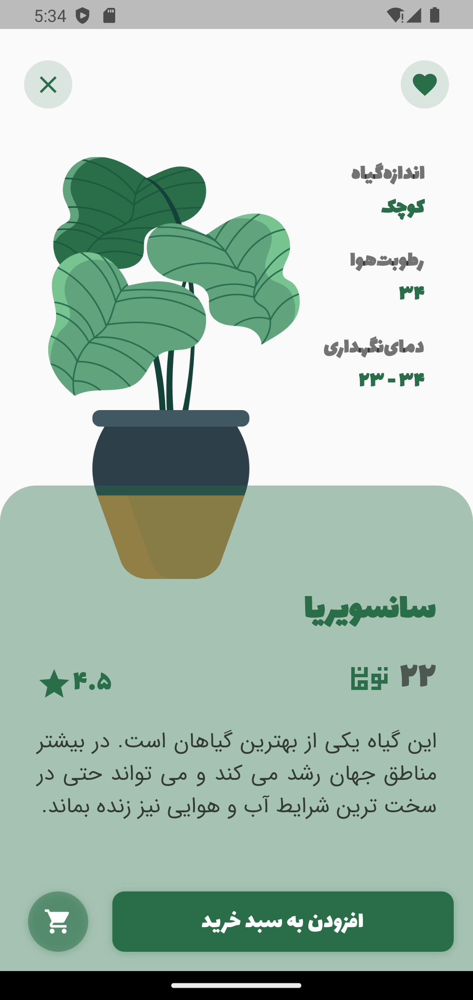

# 🌿 Plant App

یک اپلیکیشن زیبا و کاربردی ساخته شده با **Flutter** برای مدیریت و نمایش گیاهان آپارتمانی، باغچه‌ای و گیاهان محل کار.  
این پروژه به صورت **UI Showcase** طراحی شده و شامل بخش‌های مختلف مثل لیست گیاهان، علاقه‌مندی‌ها ⭐ و سبد خرید 🛒 است.

---

## ✨ ویژگی‌ها
- 🏡 دسته‌بندی گیاهان (آپارتمانی، محل‌کار، باغچه‌ای و پیشنهادی)
- ⭐ قابلیت افزودن به علاقه‌مندی‌ها
- 🛒 مدیریت سبد خرید
- 📱 طراحی مدرن و انیمیشن‌های جذاب
- 🎨 استفاده از پکیج‌های Flutter مثل:
  - `animated_bottom_navigation_bar`
  - `page_transition`
  - `mobile_scanner`

---

## 📸 تصاویر اپلیکیشن

| صفحه اصلی | جزئیات محصول | علاقه‌مندی‌ها |
|------------|--------------|----------------|
|  |  |  |

| سبد خرید | اسکن QR | پروفایل |
|-----------|----------|----------|
|  |  |  |

| دسته‌بندی‌ها | پیشنهاد ویژه | درباره ما |
|---------------|--------------|-----------|
|  |  |  |

| 🌿 پایانی 🌿 |
|--------------|
|  |

---

## 🚀 نصب و اجرا

```bash
# کلون کردن پروژه
git clone https://github.com/YourUsername/plant_app.git

# ورود به پوشه پروژه
cd plant_app

# نصب پکیج‌ها
flutter pub get

# اجرای برنامه
flutter run
